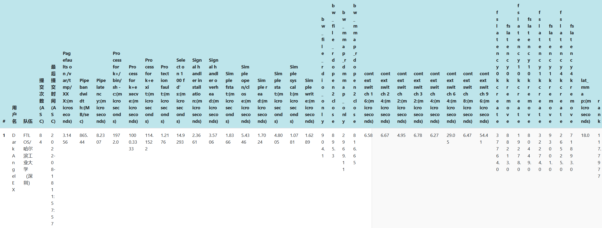

# FTL OS

FTL OS(faster than light)是2022全国大学生计算机系统能力大赛内核实现赛道的参赛操作系统，来自哈尔滨工业大学（深圳）。FTL OS使用rust语言开发，基于rust async无栈协程进行上下文切换。FTL OS追求极致的性能与高可扩展性，支持qemu平台与Hifive Unmatched平台运行。

   

## 项目结构

[doc](doc)：项目文档，包含[项目文档](doc/基于RISC-V 64的多核异步操作系统FTL OS.pdf)、[文档目录](doc/README.md)与[内核设计](doc/内核设计.md)。

[code](code)：项目代码，各个文件夹的描述如下：

|         文件夹         |                       描述                        |
| :--------------------: | :-----------------------------------------------: |
|       bootloader       |                   sbi二进制文件                   |
|      dependencies      |                 项目依赖的外部库                  |
|          disk          |       决赛第一阶段的发布版本，会被写入磁盘        |
|        easy-fs         |      rCore-tutorial-v3的ext2文件系统，已弃用      |
|      easy-fs-fuse      | 通过easy-fs生成`fs.img`磁盘文件供qemu使用，已弃用 |
|         fat32          |           FTL OS的FAT32异步多核文件系统           |
|       fat32-fuse       |    通过fat32生成`fat32.img`磁盘文件供qemu使用     |
|        ftl-util        |              FTL OS所有模块的基础库               |
|          init          |           这里的所有文件都会被写入磁盘            |
|         kernel         |                    FTL OS内核                     |
| testsuits-for-oskernel |                   初赛测试程序                    |
|       libc-test        |           决赛第一阶段的测试程序源代码            |
|          user          |   修改自rCore-tutorial-v3，包含shell与测试程序    |
|          vfs           |           FTL OS的异步多核虚拟文件系统            |

## 如何运行

#### qemu运行

qemu运行FTL OS必须在kernel文件夹中进行：

```shell
cd code/kernel
```

安装必要的rust riscv工具链：

```shell
make env
```

生成FAT32标准的文件系统，此命令只需要执行一次：

```shell
make fs-img
```

生成磁盘后就可以运行FTL OS了：

```shell
make run
```

fs-img中已经加载了决赛第一阶段的测试用例，如果想运行，请在进入OS的shell后输入：

```shell
run_all_case
```

shell将读取两个测试脚本并运行测试用例，下面是默认状态下的输出：

```shell
Rust user shell
>> run_all_case
========== START entry-static.exe argv ==========
Pass!
========== END entry-static.exe argv ==========
...
```

#### Hifive Unmatched的评测机模式运行

请直接在项目根目录下运行：

```shell
make all
```

此命令将激活feature：`submit`、`board_hifive`，初始化完成后依次运行所有的测试程序。文件系统将假设SD卡使用FAT32文件系统且只有一个分区。此模式使用离线编译，请确保本地已经按照大赛标准安装了rust依赖库，或使用qemu方式编译一次来下载相关的库。

#### Hifive Unmatched普通模式运行

请直接在项目根目录下运行：

```shell
make native
```

此命令仅激活feature：`hifive`，初始化完成后依次运行所有的测试程序。此模式用于本地调试，FTL OS没有读取SD卡分区表而是用magic number定位文件系统。如果文件系统初始化失败很可能是使用了错误的超级块号，请手动在[这里](code/kernel/src/drivers/block/mod.rs)修改`BPB_CID`为正确的超级块块号。

## 项目人员

FTL OS全部成员都来自哈尔滨工业大学（深圳）。

叶自立（队长）：内核设计，文件系统设计。

樊博：linux实现研究，操作系统测试。

李羿廷：SD卡驱动实现，信号系统。

指导老师：夏文老师、仇洁婷老师。

## 决赛第一阶段

FTL OS已经在决赛第一阶段的评测中通过了全部测试点，获得了220分。

## 决赛第二阶段

FTL OS已经通过了全部比赛测试，针对性地进行了性能优化，完成了部分移植工作。

截至2022年8月18日18:39，FTL OS得分为117.7977，排名第一。



### 扩展任务-移植

FTL OS正在尝试移植rustc编译器，移植尚未完成。
