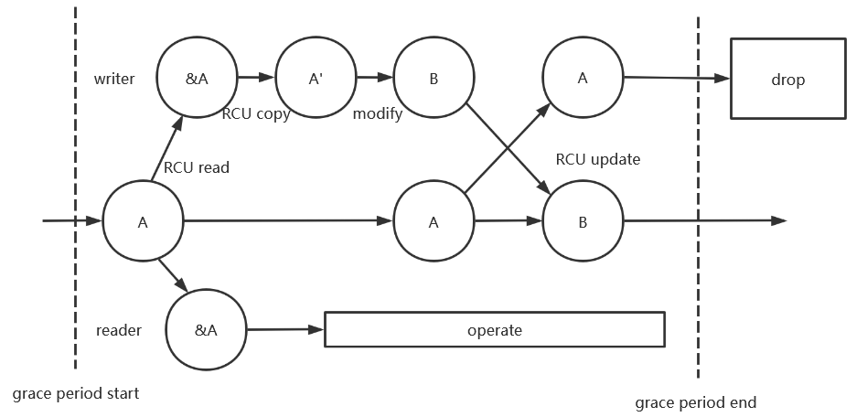

# RCU系统

RCU(Read-Copy Update)，顾名思义就是读-拷贝-修改。对于被RCU保护的共享数据，读者不需要获得任何锁就可以访问它，但写者在访问它时首先拷贝一个副本，然后对副本进行修改，修改完成后把指向原来数据的指针替换为指向新数据的指针，最后使用一个回调函数在所有引用该数据的CPU都退出对共享数据的访问时释放旧数据的内存。

对于需要频繁读但是不需要频繁写的共享数据RCU是一种非常成功的同步机制。它可以实现多线程无阻塞地读取数据，就算有线程在修改数据时读者也不会被阻塞，且读取数据时除了内存屏障外没有额外同步开销，不会读取到不完整的数据，尽管数据可能不是最新的。

RCU实现的关键是确定释放旧数据时所有读者都必须完成访问。通常把写者开始更新，到所有读者完成访问这段时间叫做宽限期（Grace Period）。如果不对读者作任何限制那么宽限期将是无尽的，但我们可以合理限制读者的最大访问作用域。linux中RCU读者作用域的限制为不能经过抢占点，因此在抢占发生之前所有通过RCU解引用的指针都是有效的。

FTL OS使用了无栈上下文切换，因此抢占只可能在`await`处发生。rust编译器强大的生命周期分析能力可以在编译时发现代码的错误，和自旋锁相同，FTL OS将RCU读者的guard标记为`!Send`，于是通过`rcu_read()`获取的指针都无法越过`await`了，保证了安全性。下图展示了RCU的更新过程：



图中读者获取A的引用后可以一直使用至宽限期结束，在这期间A的内存不会被释放，写者的修改也不会作用于A。A被替换为B后其他核不再可以访问到旧的A，但已经持有的A的引用可以持续使用，尽管A的值并不是最新的版本，在大多数情况下使用旧的数据不会有太大的负面影响。不可变数据结构天然适用于RCU更新，因为它完全没有上图中修改过程，直接在原数据上创建新的数据结构，开销极小。基于引用计数的不可变数据结构会进行大量原子操作降低性能，但不可变数据结构可以在不STW的情况下使用图可达性搜索，只要保证当前数据结构只有一个线程在回收即可。

## RCU接口

FTL OS使用了非常简单且高效的方式来实现RCU操作，接口定义如下：

```rust
// ftl-util/src/rcu/mod.rs
pub struct RcuDrop(usize, unsafe fn(usize));

pub trait RcuCollect: Sized + 'static {
    fn rcu_assert();
    fn rcu_read(&self) -> RcuReadGuard<Self>;
    unsafe fn rcu_write(&self, src: Self);
    unsafe fn rcu_transmute(self) -> RcuDrop;
    fn rcu_drop(self);
}
```

这里只展示了`RcuCollect`的接口定义，实际代码中RcuCollect提供了完善的默认实现，任何满足RCU要求的类型都可以实现`RcuCollect`且不需要重写任何函数。这几个函数的作用如下：

|    函数名     |                             描述                             |
| :-----------: | :----------------------------------------------------------: |
|  rcu_assert   | 判断类型是否满足RCU要求，即类型大小不能大于`usize`的大小，类型大小和类型对齐是否一致。 |
|   rcu_read    |         获取一个RCU临时对象，此对象不能跨越`await`。         |
|   rcu_write   |       将旧数据更新为新数据，旧数据调用`rcu_drop`释放。       |
| rcu_transmute |                    类型擦除并获取析构函数                    |
|   rcu_drop    |    使用处于全局空间的`self::rcu_drop`函数进行RCU延迟析构     |

所有函数在调用之前都会使用`rcu_assert`判断此类型是否满足RCU条件，如果不满足将panic。`rcu_assert`保证了此类型的load和store操作都可以用一条指令完成，即内存读写是原子的。绝大多数RCU对象是指针，FTL OS对`Box`、`Arc`、`Weak`这三个alloc库提供的智能指针都实现了`RcuCollect`，满足绝大多数使用场景。一般来说用户只需要使用`rcu_read`和`rcu_write`两个函数，其他函数主要被RCU释放系统使用。

## RCU释放系统

RCU释放系统追踪每一个宽限期，当每一个CPU都离开当前宽限期时释放注册此宽限期上的RCU对象。管理系统的定义为：

```rust
// ftl-util/src/rcu/mod.rs
pub struct RcuDrop(usize, unsafe fn(usize));

// ftl-util/src/rcu/manager.rs
pub struct CP {
    rcu_current: Vec<RcuDrop>,
    rcu_pending: Vec<RcuDrop>,
}
pub struct RcuManager<S: MutexSupport> {
    flags: AtomicU64,
    cp: SpinMutex<CP, S>,
}
```

RcuDrop封装了元素对象与对应的释放函数指针，当管理器释放此对象时对数据应用释放函数即可。由于RCU对象必须保证读写的原子性，尺寸不可能大于usize，因此可以用usize来表示。

RCU管理器将宽限期划分为两部分，当前宽限期和下个宽限期。`flags`原子变量将追踪当前宽限期，支持最多32个CPU同时运行。`flags`划分为高32位和低32位，高32位为处于当前宽限期的CPU集合，低32位为处于当前宽限期或下个宽限期的CPU集合。`rcu_current`字段是当前宽限期结束时将释放的对象集合，`rcu_pending`是下个宽限期结束时将释放的对象集合。第x号CPU每次进入宽限期都会将`flags`中的下一个宽限期对应位置（第x位）原子地设为1，离开宽限期时将当前宽限期和下个宽限期的对应位（第x位和第x+32位）同时原子地置为0。这里需要作一些特殊判断，如果当前宽限期只有当前CPU所属的位为1，`flags`会左移32位，再设置x+32位为1，保证在当前CPU回收完成时不会有另一个CPU也进入回收状态。回收时将移动`rcu_pending`至`rcu_current`，但取出的待回收对象不会马上回收，而是先将`flags`的x+32位置为0后再进行回收。这是因为回收状态的持续时间可能很长，在这期间积累的与RCU释放系统的对象都是不可回收的。而如果在回收之前将`flags`的x+32位置为0则允许多个CPU同时进行回收，除了提高了速度之外还能防止注册速度超过回收速度导致内存不足。离开宽限期时对`flags`的操作为CAS操作，保证了原子性。

第x个CPU离开宽限期的过程如下：

1. 以Relaxed内存序读取`flags`并命名为v。
2. 将v的x位和x+32位置为0。
3. 如果此时v的高32位为0，v左移32位，将`release`标志设为true。
4. 无锁读取`rcu_pending`与`rcu_current`的长度，如果任意一方的长度不为0则将`need_release`标志设为true，并将v的第x+32位置为1。
5. 使用CAS更新`flags`，如果更新失败则返回1。
6. 如果`release`和`need_release`之一为false，离开宽限期结束，否则进入回收流程。
7. 有锁地取出`rcu_pending`并将其替换至`rcu_current`，保存`rcu_current`的旧数据。
8. 将`flags`的第x+32位置为0。
9. 释放`rcu_current`的旧数据，回收结束。

`flags`置为0时高32位可能为0，此时不会从`rcu_current`继续获取数据，因为严格按时释放没有太大意义，在这期间注册到释放系统的对象可以等待至下一次回收。

上边的说法太过具体，下面作更抽象的解释。

RCU释放系统中包含两个待释放的集合C和P，两个集合都有各自的标志位来追踪可能引用集合中元素的CPU。所有CPU都只能向P集合提交释放申请，而当C集合不存在CPU的引用时，C就会被释放，并将P集合连同标志位移动到C集合。进入临界区时就增加P集合中对应CPU的标志位，而离开临界区就清除P和C集合的标志位，如何标志位归零了就说明这个集合该释放了。为了方便，这里只处理了C标志位归零的情况，而P标志位会等待至下个释放周期才被释放，这种情况只会在单个核工作的时候发生。

unmap后一种潜在的错误是CPU释放页表后页面的TLB在另一个CPU依然存在，如果立刻将页表回收并用于内核态的其他部分，用户态对页面的修改会破坏内核数据。利用RCU释放可以非常简单的解决这种问题，即将用户态也标识为RCU临界区，并将unmap释放的页面以RCU回收，错误TLB的CPU在进入内核态后会刷表清除，在这期间这些页表都不会回收。

## RCU竞争优化

RCU释放队列是全局竞争的，这会导致并发性能下降。但RCU释放对象没有必要立刻提交到RCU释放系统中，可以先缓存在CPU的局部队列中，等待宽限期结束再统一提交至RCU释放系统。RCU释放系统也没有必要每次发生上下文切换都离开宽限期，可以设置一个阈值，只有队列长度超过阈值时才释放的对象，在队列长度超过阈值之前不关闭宽限期，此优化可以在RCU释放队列长度达到阈值之前不产生任何原子开销，但可能会增加内存占用。

有什么办法可以降低内存占用？可以考虑时间因素，在一定时间间隔后提交整个队列而不管队列的长度是多是少。但时钟中断到达并不意味着宽限期结束，因此在CPU队列中增加一个标志，每次时钟中断到达才会修改这个标志，每次宽限期结束后判断这个标志，只有标志位有效才会将释放队列提交。

## RCU读取的安全性

RCU读数据分为两个阶段，首先是从内存中取出指针，再从指针中读取数据。看起来这不会遇到任何并发问题，但事实确实如此吗？

部分处理器使用一种极端激进的优化：值预测。使用值预测的处理器会先取出预测指针指向对象的数据，然后再读取指针，最后判断预测指针和实际指针是否相等。值预测是现代CPU的优化方向之一，可以直接破除数据依赖导致的性能下降，速度可以提高数倍以上，但也会导致存在数据依赖的访问乱序。为了确保RCU读取的绝对安全，取出指针后需要添加Acquire屏障再进行数据读取。

添加内存屏障可以保证读取数据的正确性，但从内存取出指针有没有可能出问题呢？以64位平台为例，在C/C++中所有指针都是8字节的，可以由一条指令完成访问。rust则不相同，rust基于智能指针完成资源回收，通常智能指针也是8字节的，但对于包含虚表的动态类型的智能指针，C++的做法是将虚表放在成员内部，智能指针维持8字节，而rust将虚表放在了智能指针结构体内（胖指针），这样做可以减少一次寻址，但智能指针变成了16字节，**无法原子地由一条指令完成读取**，RCU读无法保证安全性。FTL OS不可能用锁来保证RCU读的安全性（用了锁还要RCU干什么？）。

事实上对于大对象，想不添加额外标志来保证大对象读取的安全性是不可能的。考虑一种情况，当写者写入一半的时候发生了上下文切换，这时读者没有任何方法辨认这个对象是不正常的。

顺序锁是RCU场景下处理大对象的优秀替代方式，读者没有原子开销，使用额外标志来保证读者的正确性并兼顾写者锁。顺序锁内部包含一个原子的访问ID，只有写者可以修改ID的值。奇数ID表示有锁，偶数表示无锁。写者使用CAS方式获取锁，释放锁时写入递增后的ID。读者在操作之前会获取一次ID的值，如果不为偶数则等待，操作后再获取一次ID的值，如果和第一次不相同则重新操作，直到ID相同为止。顺序锁读者的唯一同步开销就是两次读取和操作之间的两条内存屏障，当写者占比非常小时几乎没有额外开销。

使用顺序锁可以处理任意大小的对象并保证读者无锁，看起来完美无缺，但实际上也是有限制的。典型例子是写者操作时将一个指针变为了空指针，但读者以为它是有效指针。于是读者引发了一次内存访问导致的异常，而异常的唯一的解决方法是引入异常处理机制，而捕获内存异常会导致一系列更复杂的问题。

因此顺序锁很难使用在红黑树一类的高级数据结构上，除非让数据结构作针对性优化。最安全的方式还是如RCU读取一样，以值的方式将整体复制出来，而写者也采用整体更新的方式，并以RCU方式释放被替换的对象。
