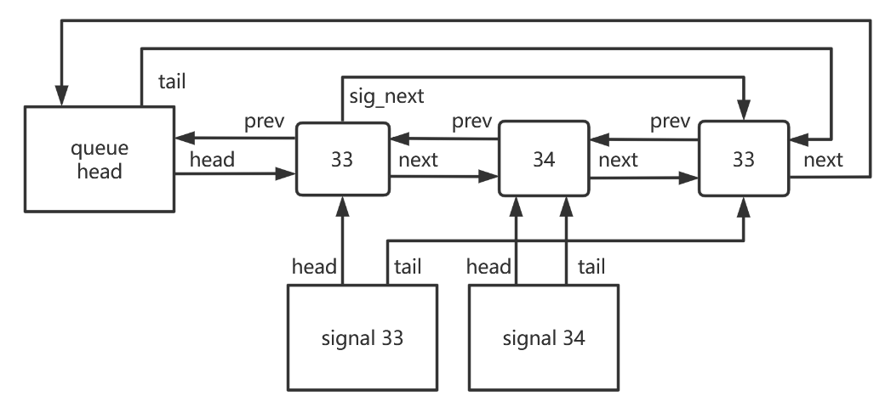

# 信号系统

## 预研

FTL OS信号系统参考自Linux，使用与Linux完全一致的接口，但部分选项未实现。

> 信号处理时原来的上下文保存在哪里？

信号处理函数可以打断原本的控制流，因此在处理信号时需要保存原来的上下文。FTL OS不希望只局限于简单的，无法无限嵌套的，需要在内核态分配内存的信号实现，因此使用了Linux中的方式：将原上下文保存在用户态，不在内核态记录原上下文信息，当处理函数结束后从用户态取出。

为了追踪原上下文，需要将此上下文的指针保存在内核态，当此指针改变时原指针会被压入上下文栈。

> 信号处理函数运行在哪个栈？

在Linux上测试信号处理，输出处理函数和main函数中一个局部变量的地址，发现这两个地址的差约300字节。这么小的地址差说明Linux处理信号并没有开辟新的栈空间，而是直接运行在原来的栈上。这样当然有局限性，例如当发生栈溢出时信号处理函数就没有位置运行了，因此Linux提供了修改信号运行栈的接口，允许让信号运行在另外的栈空间。

>如何让信号处理函数返回时进入内核态？

设置进入信号处理函数时的ra寄存器为sigreturn系统调用的地址，在用户地址空间映射一页信号跳板页，里面为sigreturn的入口。这需要4KB的空间，事实上libc内置了sigreturn并将地址写在了sigaction中的restore上，可以直接使用。

> Linux如果同时收到多个信号，它是怎么处理的？

Linux允许不同信号嵌套，即当处理信号A时收到了信号B，则挂起A的流程直接开始处理B，前提是B没有被屏蔽。如果信号A没有处理完成前又收到了信号A，信号A不会发生递归而是等待当前信号A处理完成后再处理一次。这是因为信号处理时会屏蔽自身，如果手动关闭屏蔽位则可以发生同一个信号的嵌套处理。信号处理开始前会将旧屏蔽位也压入栈，因此处理信号时修改的屏蔽位在处理完成后不再生效。

> 如何支持实时信号？

实时信号支持排队，按序处理。这可能会导致巨大的内存开销，因此内核会限制排队数量，Linux定义了排队数量不小于32。由于阻塞的存在，在队列中找到第一个未阻塞的信号可能很耗时，因此可以使用额外的数据结构来操作队列。

## 实现

FTL OS实现信号处理的基本函数：

| 函数           | 描述                         |
| -------------- | ---------------------------- |
| rt_sigaction   | 系统调用，定义信号行为       |
| rt_sigprocmask | 系统调用，设置信号掩码       |
| rt_sigreturn   | 系统调用，信号处理函数返回   |
| handle_signal  | 进入用户态之前运行，处理信号 |

## 相关数据

为了实现信号处理，需要明确信号系统相关的数据。

* 信号处理操作：由于信号处理操作是进程内所有线程共享的，放置于进程控制块。
* 进程待处理信号集合：本进程等待处理的信号。标准信号使用32bit保存，按优先级处理；实时信号使用32bit记录是否存在，以及32个实时信号计数器。
* 线程待处理信号集合：本线程等待处理的信号。使用和进程待处理信号相同的方式管理，但其他线程只能通过通信方式注册信号，降低本线程原子开销。
* 当前信号掩码：由于进行信号处理会改变信号掩码，而每个线程互不相同，因此它放置于线程控制块。掩码使用64bit表示。
* 旧信号掩码：由于信号可以使用手动修改mask的方式来嵌套，因此不能在退出处理函数后直接删除信号掩码位，必须保存旧的信号处理掩码，处理完成后写回。信号掩码是上下文的一部分，和原上下文一同保存。
* 上下文指针：为了在信号处理结束时取出上下文，需要在内核态放置上下文指针。
* 旧上下文指针：为了在信号嵌套后成功恢复，需要保存旧上下文指针，此地址保存在用户态。
* 上下文：为了实现无限信号嵌套，上下文保存在用户态。上下文包括32个通用寄存器，32个浮点寄存器，旧信号掩码，旧sepc，旧上下文指针。参考Linux，默认下这些值全部压入当前用户栈中，如果栈爆了则abort。用户可以显式修改某个信号的栈地址，这在处理栈溢出时非常有用。
* sigreturn入口：进入信号处理函数时ra被设置为sigreturn。原本我们想映射一个信号trampline，但又发现了libc内置了restore函数，它会进入sigreturn系统调用，我们要保证sigreturn永不返回。restore在sigaction中被设置，因此不再需要开一个4KB的页面给信号trampline了。

## 实时信号加速数据结构

使用双向链表保存实时信号队列，在此之外对每一个信号增加一个指针指向最靠前的队列单元。搜索之前先遍历信号8下，如果前8个信号都被阻塞了则修改为遍历32个信号指针，找到最靠前的单元，这保证了遍历次数小于32，无论队列多长都可以保证速度。

队列单元包含是数据：prev指针，next指针，信号ID，信号计数，下一个同信号单元指针。

快速搜索单元包含：第一个指针，最后一个指针。

为了快速获知信号是否存在，还有32bit存在信号掩码。

下图是加速数据结构的一个例子，此时数据结构中存在了3个排队的信号。最左端的节点是全局信号队列，从他可以O(1)的获取链表的头部和尾部，分别用于删除和插入操作。下侧的两个节点是信号分队列，每种信号对应一个分队列， 一样可以O(1)地获取分队列的头部和尾部用于删除和插入。

当我们获取到某个信号节点后，利用链表的特性可以O(1)地把它从数据结构中删除。加入队列也非常简单，我们只需要分别把它加入全局队列链表和信号队列链表的末尾即可，而尾指针都可以O(1)地获得。为什么要对每种信号开设各自的队列？因为线程可能屏蔽了某个信号，如果只有一个队列，而队列靠近头部的位置存在大量的等待信号，那么这个数据结构就会退化为O(N)。而加入每种信号的链表后，我们只需要遍历32个各自信号的队列就一定可以找到未被屏蔽的信号，而无论其他信号队列上等待了多少信号，时间复杂度降为O(1)。

为了保证遍历分队列时获取到的信号是最新的信号，还需要在信号节点中加入信号队列ID，每次加入队列的信号都会获得一个新的ID并严格递增。

## 线程信号和进程信号

操作系统既允许向进程发送信号也允许向线程发送信号，这就需要分别在线程和进程中分别维护两个信号队列。显然进程信号队列是需要加锁的，但线程信号队列每个线程都有一个，是否可以绕过锁呢？FTL OS采用了类似多核通信的方案，在线程信号管理器上维护一个有锁的邮箱，其他核向线程发送信号时就提交到这里。而本线程在处理信号时会取出邮箱并将它搬运到本地的无锁信号队列中，这样就可以批量地处理外部发送的信号了。

为了减少获取进程信号队列锁的次数，进程信号管理器包含一个写入ID，每个线程上也包含一个读取ID。当线程会先无锁地获取写入ID，如果写入ID和读取ID相等就跳过获取锁的过程，否则会获取锁并获取队列，并更新自身的读取ID。只有向队列加入信号需要更新写入ID，从队列中取出信号不需要更新写入ID。

FTL OS处理信号的优先级从高到低排列如下：

* 线程/进程的不可捕获信号
* 线程标准信号
* 进程标准信号
* 线程实时信号
* 进程实时信号

## 信号操作

### rt_sigaction

此函数仅仅是注册一个信号的处理函数，不涉及复杂的数据修改。

### rt_sigprocmask

此函数仅仅是修改当前线程的信号掩码，没有其他复杂的操作。

### rt_sigreturn

信号返回。具体流程如下：

* 取出上下文指针，如果指针为空说明不存在信号嵌套，直接返回-1或者abort。
* 从上下文指针恢复通用寄存器，浮点寄存器，旧信号掩码，旧sepc，旧上下文地址。
* 函数结束，返回a0寄存器的值。

### handle_signal

在进入用户态之前处理信号。具体流程如下：

* 无锁unsafe检查线程信号信箱，如果存在则加锁并将信箱中的信号更新进本地信号集合中。
* 检查本地信号集，如果存在则进入下边的信号处理部分，不存在则检查进程信号集。
* 无锁unsafe取出进程信号集。如果不存在不被阻塞的信号则直接返回。
* 现在存在可以处理的信号。获取信号集锁，重复一次上一步检查，因为没有获取锁取出的数据是不可信的。
* 优先处理标准信号集再处理实时信号集。如果处理标准信号集则删去对应的位，如果处理实时信号集则找到最小的不被阻塞的信号，递减实时信号计数，如果减为0了则清除标志位。释放锁。
* 现在取出了要处理的信号。从sigaction注册数组中取出信号的处理方式action。判断handler，如果为0则abort，如果为1则忽略，否则进入下一步：
* 取出用户栈指针或用户指定的栈基址，偏移上下文的大小并对齐16字节，将当前上下文写入，包括通用寄存器，浮点寄存器，掩码，sepc，上下文指针。
* 修改a0寄存器为信号ID，ra设为restore，sepc设为handler，上下文指针指向当前上下文。为了提高速度，其他寄存器不清零了。
* 结束，进入用户态。

## 更快的信号检测

每次从内核态回用户态之前都要检测信号是否存在。有没有什么方法可以快速忽略未收到信号的情况？

lmbench中有个需要处理SEGV信号的测试，在支持它后得分反而降低了4%，这是因为信号检测必须在快速处理路径中进行，任何增大的开销都会反应到其他的全部项目！我们需要更高效的方式来加快信号的检测，在不存在信号时用最快的速度跳过它。

FTL OS的信号除了能发送给进程外还能发送给线程，因此每次回用户态都必定需要检测这两处的信号。是否可以用最少的路径完成信号的检测呢？

首先要明确4%性能下降的来源。旧的信号检测方式是这样的：线程本地和线程信号信箱都存在一个序号，信号信箱新增信号就会增加信箱序号，本地同步信箱后就会将本地序号设置为和信箱相同，这样只要本地无锁检测到序号没有发生变化就说明没有接收到新的信号。

这个做法是有问题的。因为信号信箱没有收到新的信号不能证明本地信号已经处理完成，因此还需要检测本地的信号队列是否为空。这个检测过程直接导致了性能的显著下降。因此接下来的优化就是加快本地信号的判断过程，并压缩在两次访存和一条分支中。

在本地增加一个信号处理标志位，这个标志位表明本地是否存在仍未处理的信号。为了提高速度，我们不单独放置标志位，而是放置在本地信号序号的最低位上。与此同时信箱序号的更新从递增1改为递增2，并时刻保证它的最低位为0。最终的判断方式就是判断本地序号和信箱序号的异或值是否为0，如果为0就直接跳过。
