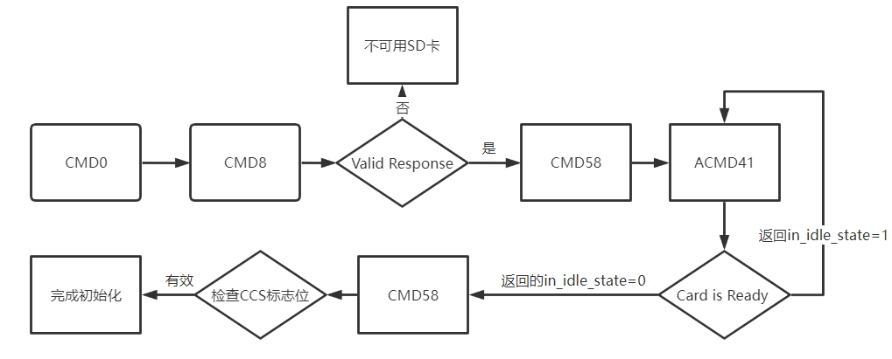

# SDcard驱动

Hifive Unmatched平台缺少必须的SD卡驱动，因此我们参考了K210的SD卡驱动实现了基于SPI协议的可以在Hifive Unmatched平台的SD驱动。

## SPI协议

|   文件   |   实现   |
| :-------:|:--------:|
|layout.rs | 内存映像抽象及通信|
|  mod.rs  | SPIActions接口定义|
| registers.rs | spi控制寄存器抽象|

按照registers.rs,mod.rs,layout.rs依次介绍。

### 1. registers.rs

首先定义一个通用的寄存器结构体Reg。

```rust
pub struct Reg<T: Sized + Clone + Copy, U> {
    value: T,
    p: PhantomData<U>,
}
```

然后实现new,以及一些读写的基本操作。

```rust
impl<T: Sized + Clone + Copy, U> Reg<T, U> {
    pub fn new(initval: T) -> Self {
        Self {
            value: initval,
            p: PhantomData {},
        }
    }
}

impl<T: Sized + Clone + Copy, U> Reg<T, U> {
    pub fn read(&self) -> T {
        let ptr: *const T = &self.value;
        unsafe { ptr.read_volatile() }
    }
    pub fn write(&mut self, val: T) {
        let ptr: *mut T = &mut self.value;
        unsafe {
            ptr.write_volatile(val);
        }
    }
}
```

随后逐个实现SPI协议中控制寄存器的实例,有关其中具体的值可以参考文档[SD卡中的SPI协议控制寄存器](https://sifive.cdn.prismic.io/sifive/1a82e600-1f93-4f41-b2d8-86ed8b16acba_fu740-c000-manual-v1p6.pdf)中的第19章，这里仅列出寄存器的相关功能(按照registers中寄存器的实现顺序):

|   控制寄存器   |   相关字段及功能   |
| :-------:|:--------|
|SCKDIV | 控制串行时钟的频率|
|SCKMODE | 控制数据采样和切换数据和时钟上升下降沿的关系|
|CSID | 片选寄存器,实现SD卡的选择,这里由于只有一块SD卡,只实现了寄存器的reset|
|CSDEF | 设定片选线|
|CSMODE | 设置片选模式<br>1.AUTO：使CS生效或者失效在帧的开始或结束阶段<br>2.HOLD: 保持CS在初始帧之后一直有效<br>3.OFF：使得硬件失去对CSpin的掌控|
|DELAY0 | cssck字段：控制CS有效和SCK第一次上升沿之间的时延<br>sckcs字段：控制SCK最后的下降沿和CS失效之间的时延|
|DELAY1 | cssck字段：intercs字段：控制最小CS失效时间<br>interxfr字段：控制两个连续帧在不丢弃CS的情况下之间的延迟，只在sckmod寄存器是HOLD或者OFF模式时使用 |
|FMT | 设置协议，大小端和方向等，传输数据的长度|
|TXDATA | data字段：存储了要传输的一个字节数据，这个数据是被写入FIFO的，注意大小端<br>full字段：表示FIFO是否已满，如果已经满了，则忽略写到tx_data的数据这些数据自然也就无法FIFO|
|RXDATA | data字段：存储了要传输的一个字节数据，这个数据是被写入FIFO的，注意大小端<br>full字段：表示FIFO是否已满，如果已经满了，则忽略写到tx_data的数据这些数据自然也就无法FIFO|
|TXMARK | 决定传输的FIFO的中断在低于多少阈值下进行触发<br>txmark字段:当FIFO中的数据少于设置阈值时会触发中断，导致txdata向FIFO中写入数据|
|RXMARK | 决定接收的FIFO的中断在高于多少阈值时触发<br>rxmark字段：当FIFO中的数据超出阈值时会从FIFO中读取数据|
|FCTRL | 控制memory-mapped和programmed-I/O两种模式的切换|
|FFMT | 定义指令的一些格式例如指令协议，地址长度等等|
|IE | txwm字段：当FIFO中的数据少于txmark中设定的阈值时，txwm被设置<br>rxwm字段：当FIFO中的数据多余rxmark中设定的阈值时，rxwm被设置|
|IP | txwm悬挂字段:当FIFO中有充足的数据被写入并且超过了txmark时，txwm的悬挂位被清除<br>rxwm悬挂字段:当FIFO中有充足的数据被读出并且少于rxmark时，rxwm的悬挂位被清除|

其中TXMARK和RXMARK寄存器以及IE和IP寄存器对后面的控制数据传输起着重要的作用，具体表现如下：

1. TXMARK设置了写中断的界限，设置了TXMARK后，若FIFO中的数据少于设定的值，就会将TXDATA中的数据写入FIFO直到满足其中的数据量大于TXMARK值，这个中断是由IE来判断的，所以我们如果在中断以后，可以依据IE中的相关标志位设置循环，然后直到写入FIFO数据超过相关阈值。
2. RXMARK设置了读中断的界限，设置了RXMARK后，若FIFO中的数据多于设定的值，就会将FIFO中的数据读入RXDATA中直到FIFO中的数据量少于RXMARK值，这个中断也是由IE来判断，所以在中断以后，就根据标志位设置循环以不停读出FIFO中的数据，直到FIFO中的数据低于相关阈值。

### 2. mod.rs中的SPIActions

```rust
pub trait SPIActions {
    fn init(&mut self);
    fn configure(
        &mut self,
        use_lines: u8,       // SPI data line width, 1,2,4 allowed
        data_bit_length: u8, // bits per word, basically 8
        msb_first: bool,     // endianness
    );
    fn switch_cs(&mut self, enable: bool, csid: u32);
    fn set_clk_rate(&mut self, spi_clk: usize);
    fn send_data(&mut self, chip_select: u32, tx: &[u8]);
    fn recv_data(&mut self, chip_select: u32, rx: &mut [u8]);
}
```

一个接口，用于实现SPI协议的一些动作：
init:初始化<br>
switch_cs:设置片选<br>
set_clk_rate:设置时钟频率<br>
send_data:发送数据<br>
recv_data:接收数据<br>

### 3. layout.rs中的内存映像以及SPI协议通信

这一部分就是实现SPI设备的内存映像以及实现如何通信。
具体如何通信可以参考Technical Commitee SD Card Association发布的SD Specifications的第7章。

#### SPI设备的三种实例

```rust
pub enum SPIDevice {
    QSPI0,
    QSPI1,
    QSPI2,
    Other(usize),
}
```

这三种不同的实例分别对应了SPI设备在内存中的不同起始位置:

```rust
impl SPIDevice {
    fn base_addr(&self) -> PhyAddr<RegisterBlock> {
        let a = match self {
            SPIDevice::QSPI0 => 0x10040000usize,
            SPIDevice::QSPI1 => 0x10041000usize,
            SPIDevice::QSPI2 => 0x10050000usize,
            SPIDevice::Other(val) => val.clone(),
        };
        PhyAddr::from_usize(a)
    }
}
```

RegisterBlock就是利用了之前registers中实现的寄存器定义的一个结构体,也就是SPI协议控制器块。

#### SPIImpl结构体

用SPIImpl结构体实现对SPIDevice的进一步封装，这一层封装主要实现了数据的收发，以及在中断悬挂位没有挂起时的循环等待。

```rust
pub struct SPIImpl {
    spi: SPIDevice,
}
impl SPIImpl {
    fn tx_fill(&mut self, data: u8, mut n: usize) {
        while n != 0 && !self.spi.txdata.is_full() {
            self.spi.txdata.write(data as u32);
            n -= 1;
        }
    }
    fn tx_enque(&mut self, data: u8) {
        debug_assert!(!self.spi.txdata.is_full());
        self.spi.txdata.write(data as u32);
    }
    fn rx_deque(&mut self) -> u8 {
        match self.spi.rxdata.flag_read() {
            (false, result) => return result,
            (true, _) => panic!(),
        }
    }
    // 返回可以取出的最大数据数量
    fn rx_wait(&self) {
        while !self.spi.ip.receive_pending() {
            // loop
        }
    }
    // 返回可以发送的最大数据数量
    fn tx_wait(&self) {
        while !self.spi.ip.transmit_pending() {
            // loop
        }
    }
}
```

#### 实现SPIActions的接口

|   接口名称   |   实现功能   |
| :-------:|:--------|
|init | 设置csdef，中断使能寄存器ie，水位寄存器，延迟寄存器，fcrl控制寄存器|
|configure | 设置帧格式寄存器，sckmode寄存器|
|set_clk_rate | 片选寄存器,实现SD卡的选择,这里由于只有一块SD卡,只实现了寄存器的reset|
|recv_data | 接收逻辑如下：<br>1.通过fmt寄存器设置方向为接收方向<br>2.设置对应的片选csid<br>3.对FIFO中的数据迭代:<br>&emsp;由于spi一定是全双工的，所以在读取一个字节时要发送无用信息<br>&emsp;设置接收水位寄存器<br>&emsp;等待中断<br>&emsp;接收数据|
|send_data | 发送逻辑如下：<br>1.通过fmt寄存器设置方向为发送方向<br>2.设置对应的片选csid<br>3.对FIFO中的数据迭代:<br>&emsp;通过FU740文档可知，在传输数据时接收线是不被激活的，所以这里不需要也接收数据<br>&emsp;设置发送水位寄存器<br>&emsp;等待中断<br>&emsp;发送数据|

## SD卡驱动

SD卡进行SPI通信的过程实际上是host发送指令，SD卡做出回应这样的方式。

### 初始化


这是SD卡进入SPI模式的一个过程，可以看到，是主机发送CMD指令和SD卡进行交互，在“一切就绪”（包括电压范围等）后，SD卡就进入了SPI通信的模式。

### 读写数据块


#### 读一个块的过程如下

1. host发出读一个块的指令
2. SD卡response
3. SD卡返回一个块加上校验码
4. 结束

#### 写一个块的过程如下

1. host发出写一个块的指令
2. SD卡response
3. host发出一个带有开始数据标志的数据块
4. SD卡接收到数据块后发出带有数据回应和busy的信息
5. 结束

在读写多个块的情况下大同小异，不同的只有指令号不一样，数据块的数量上以及个别标志位有所差异，具体请参考文档Technical Commitee SD Card Association发布的SD Specifications的第7章。

## CRC纠错

在实际测试中，目前的驱动以8MHz读取数据时，约200个扇区会发生一次错误，因此CRC校验是必须的。扇区数据的校验使用CRC16校验方法，FTL OS采用了和Linux相同的校验函数实现，将每个字节对于的256种CRC16校验状态转换硬编码在代码中，以查表的方式校验数据。一旦发生校验失败就重新传输数据。

