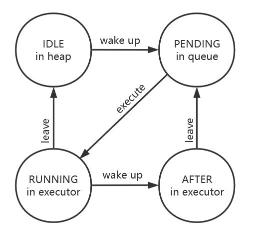

# 任务调度器

单线程下的进程调度很简单，只需要维护一个调度队列，OS不断从调度队列中取出任务运行，进程切换时把当前进程再次加入调度队列即可。多核下的情况就变得复杂起来。锁相关的不再赘述，还需要考虑以下问题：

* 一个线程被唤醒时需要加入调度队列，如果它被唤醒了两次会发生什么？
* 如果一个线程在未退出时就被唤醒了会发生什么？(例如yield)

最简单的解决方案是运行调度器中存在同一个线程的多个引用，并在线程中增加锁保证它不会被两个核心同时运行。这又会带来如下的问题：

* 如果获取的线程被另外的核心占有了，应该抛弃或死等，还是再次加入调度器？
  * 抛弃策略可能导致线程丢失。核心A占有线程T时执行了yield调用，加入调度队列。核心B在核心A离开前从调度队列获取了T，由于无法获取T的执行锁便抛弃了线程T，核心A离开线程T就永远丢失了。
  * 死等将导致极大的竞争，例如将一个线程在睡眠调度器中的同一时刻注册4次，当到达此时刻后四个核心都将阻塞在这个线程中，而只有一个核心在实际运行。
  * 再次加入调度器只能缓解死等的开销，当线程已经被占有后调度器中的其他副本事实上处于不可消失的状态，导致调度器的巨大无意义开销。

因此允许调度器中存在同一个线程的多个引用将导致极大的负面影响。要避免这种情况的发生需要考虑以下两种情况：

* 线程未运行时被唤醒，直接加入调度器即可。
* 线程运行时再次被唤醒，需要等待线程执行完成后再加入调度器。

使用这种方式就不再需要获取线程的锁了，只需要每个线程维护一个原子变量，原子变量具有如下4种状态：

|  状态   |                  描述                  | 唤醒后的状态 | 进入/离开调度器后的状态 |
| :-----: | :------------------------------------: | :----------: | :---------------------: |
|  IDLE   |       线程未运行且不处于调度器中       |   PENDING    |       impossible        |
| PENDING |        线程未运行且处于调度器中        |   PENDING    |         RUNNING         |
| RUNNING |  线程正在运行，运行结束后不加入调度器  |    AFTER     |          IDLE           |
|  AFTER  | 线程正在运行，运行结束后再次加入调度器 |    AFTER     |         PENDING         |

这种方式保证了一个线程至多在调度器中出现一次，原子变量的状态改变使用CAS或AMO操作，不需要关中断。



### async-task

FTL OS采用了async-task库辅助调度。async-task提供了工业级代码来完成上述的唤醒流程，提供的spawn接口如下：

```rust
pub fn spawn<F, S>(future: F, schedule: S) -> (Runnable, Task<F::Output>)
where
    F: Future + Send + 'static,
    F::Output: Send + 'static,
    S: Fn(Runnable) + Send + Sync + 'static;
```

FTL OS中线程不需要返回值，因此F::Output是空。F必须实现Send，这保证了FTL OS自旋锁不能跨越await。S是一个参数为Runnable的函数，async-task保证调度器中只有一个Runnable实例。Runnable是async-task内部实现类型，调用schedule()方法能将自身按上述状态规则调用参数中的schedule函数，调度器能够调用Runnable的run()方法来运行对应的future。async-task历经多次优化，相比于最简单的调度器，async-task整个过程中只进行一次内存分配，并且能够在future运行结束时立刻析构而不是等待引用计数归零，完全由原子变量无锁实现相关逻辑，具有非常高的性能。

### 优化：局部调度器与任务窃取

全局唯一的调度队列会导致较大的竞争开销，目前主流的工业调度器都加入了线程独立调度器来降低竞争。每个CPU都包含一个局部调度器，CPU优先从局部调度器获取任务，任务为空时再从全局调度器加载任务；如果全局调度器为空，调度器将尝试从其他CPU的局部调度器窃取一些任务运行。使用局部调度器的除了降低锁竞争外，还可以让被唤醒的进程优先加入上一次运行局部调度器，再次利用cache资源。

## 异步上下文切换

每一个线程都有独立的上下文（如页表，关中断计数，调试栈），而这些上下文都需要在进入future时被加载，离开future时清空。在xv6中这也有体现，例如上下文切换前后需要刷表等。

有栈上下文切换通过调用函数的方式切换上下文，因此在上下文切换函数前后增加相关逻辑即可。但无栈上下文切换不同，函数在await处发生上下文切换，函数按调用栈一次弹出，这是不是说明无栈上下文切换不能切换更复杂的上下文呢？当然不是！但要进行上下文的切换，首先要理解rust对future的处理。

rust无栈协程模型依赖Future。Future是标准核心库如下定义的trait：

```rust
pub enum Poll<T> {
    Ready(T),
    Pending,
}
pub trait Future {
    type Output;
    fn poll(self: Pin<&mut Self>, cx: &mut Context<'_>) -> Poll<Self::Output>;
}
```

Output是Future的输出类型，poll函数是这个Future的运行逻辑，返回的Poll表示future是否完成了执行。如果执行完成将返回获取到的值，如果未执行完成则返回Pending标志。

对于一个async函数，rust事实上也会编译为一个Future，根据函数体自行生成对应poll函数。生成的poll函数对于大部分情况已经足够，但如果我们要对上下文进行更细致的处理，必须手动编写Future来完成上下文切换。FTL OS的进程上下文切换Future定义如下：

```rust
// kernel/src/process/userloop.rs

struct OutermostFuture<F: Future + Send + 'static> {
    future: F,
    local_switch: LocalNow,
}
impl<F: Future + Send + 'static> Future for OutermostFuture<F> {
    type Output = F::Output;
    
    fn poll(self: Pin<&mut Self>, cx: &mut Context<'_>) -> Poll<Self::Output> {
        let local = local::hart_local();
        let this = unsafe { self.get_unchecked_mut() };
        local.enter_task_switch(&mut this.local_switch);
        if !USING_ASID {
            sfence::sfence_vma_all_no_global();
        }
        let ret = unsafe { Pin::new_unchecked(&mut this.future).poll(cx) };
        if !USING_ASID {
            sfence::sfence_vma_all_no_global();
        }
        local.leave_task_switch(&mut this.local_switch);
        ret
    }
}
```

`local_switch`是任务独立的上下文，使用`enter_task_switch()`将当前CPU上下文切换为此进程，并将源上下文保存在`local_switch`的位置。使用`leave_task_switch()`函数将当前CPU上下文切换为`local_switch`保存的原上下文，并将任务独立的上下文保存回`local_switch`。任务上下文处于另外分配的堆空间，因此切换上下文只需要修改指针，速度极快。`sfence::sfence_vma_all_no_global()`函数刷新用户页表，不会处理包含G标志位的内核全局映射。

利用泛型参数F可以将future成员和local_switch成员放入同一块内存，避免一次指针寻址。任务的具体实现在future成员中，因此上下文切换完成后将调用future的poll函数进行具体处理。
