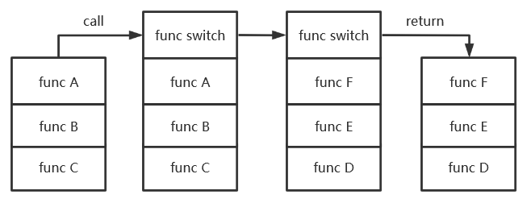
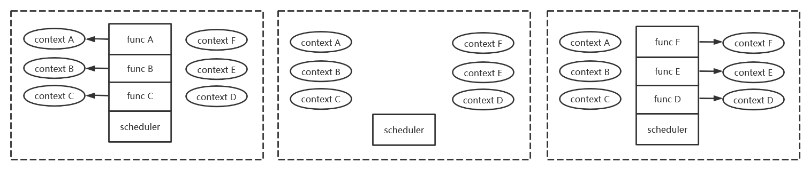

# 无栈协程

说到无栈协程，首先要说明什么是协程。协程是在用户态模拟多线程的一种方式，区别是上下文没有操作系统的介入，上下文切换完全在用户态进行。协程调度器就像在用户态运行一个轻量操作系统，管理一系列协程的运行。但协程不同于线程，协程是用户程序的一部分，完全由开发者控制，因此不像操作系统一样需要抢占式调度，而可以使用更高效的协作式调度，在固定的调度点进行上下文切换。

协程作为一个可以调度的对象允许函数在还没有完成之前离开当前的上下文，并在未来恢复并继续执行。离开一个函数只有两种方式：调用一个新函数与退出当前的函数，有栈协程和无栈协程分别对应了两种离开当前函数的方式。有栈协程的切换如下：



有栈协程的切换非常简单，因为调用一个函数不会销毁栈上数据，因此只需要保存现场并切换至待调度上下文即可。对于RISC-V，上下文切换需要改变s0-s11、ra、sp共14个寄存器，其他的临时寄存器不需要保存。上下文切换函数与其他函数对语言来说没有本质区别，因此有栈协程的切换函数可以插入至程序的任意位置，因此一段普通程序改写成有栈协程是非常简单的。有栈协程的缺点很明显，每个上下文都需要分配独立的栈空间，而函数的调用深度是无法确定的，因此很容易出现栈空间溢出或浪费空间的情况。另一个问题是上下文切换修改了函数调用栈，因此CPU内部的函数调用缓存全部失效，每次函数返回都导致一次分支预测失败，对流水线较长的高性能CPU性能开销非常大。

无栈协程通过函数返回的方式离开当前函数的上下文。无栈协程的切换如下：



`func A`切换上下文时会依次退出函数直到回到调度器，但数据依然保存在堆上。调度器执行另一个函数时根据堆上信息重新生成了调用栈，恢复执行`func F`。

rust是如何编译`async`函数的呢？对于一个`async`函数：

```rust
async fn function() {
    async_fn().await;
    async_fn().await;
}
```

rust编译器将function编译成如下的状态机：

```rust
enum Status {
    S0, S1, S2,
}

fn function_poll(mut s: Status) -> Poll<()> {
    loop {
        match s {
            Status::S0 => match async_fn_poll() {
                Poll::Ready(()) => s = Status::S1,
                Poll::Pending => return Poll::Pending,
            },
            Status::S1 => match async_fn_poll() {
                Poll::Ready(()) => s = Status::S2,
                Poll::Pending => return Poll::Pending,
            },
            Status::S2 => return Poll::Ready(()),
        }
    }
}
```

这里忽略了上下文相关的细节。可以看到，`async_fn_poll`的上下文返回的过程就是普通的函数返回，不需要进行栈的切换，不需要改变栈寄存器，CPU的函数调用缓存可以正常工作。无栈协程的切换速度远高于有栈协程，速度甚至可以达到4倍以上。

无栈协程的另一个优点是作用域跨越`await`的变量将分配在函数自身所属的结构体上，而结构体的大小是在编译时就确定的。因此在编译的时候我们就可以获知整个异步任务需要的空间大小，一次性在堆上分配，完全不需要担心栈溢出的问题。与此同时，无栈任务运行在同一个栈上，因此栈的数量就等于线程数量或CPU的数量。如此少的栈意味着可以给他们开出巨大无比的空间，不再需要担心非递归的栈溢出的问题。

无栈协程相比有栈协程依然有缺陷。无栈协程切换时花费的时间和函数的调用深度呈正比，而有栈协程的切换开销是固定的。同时无栈协程中跨越await的变量必须放在内存中，降低寄存器资源的利用率，而有栈协程的函数和普通函数没有区别，可以充分利用寄存器资源优化代码。目前rust编译器对async函数的优化能力不足，无法直接删除如`async {}.await;`这种空函数，而是给这个位置分配一个状态，尽管它根本不可能返回Pending。另外async函数中对变量跨越await的判定非常松散，无法识别生命周期的提前结束，必须显式地用花括号括起来。

## reactor异步模型

rust的无栈协程模型采用的是reactor模型。什么是reactor模型？reactor故名思意，它是一个基于响应的模型。每个`future`就在等待一个事件，如果事件发生了，事件会通过`Waker`来主动地唤醒这个future，把它加入调度器中。

`Waker`是一个统一的接口，通过虚函数表的方式隐藏了具体实现。它使我们实现线程的睡眠和唤醒就和喝水一样简单。如何睡眠？只要一个线程在执行后返回了`Poll::pending`，同时在这期间没有任何的`Waker`唤醒，它就不会再加入调度器了，因此也就睡眠了。怎么唤醒？只要通过`Waker`调用对应的`wake`方法，线程就被唤醒了。

在多核环境下是很难做到精确唤醒的。为了放置任务丢失，如果任务在执行的时候被唤醒了，那么它会在退出后立刻重新加入调度器，因此我们没有办法判断这次唤醒是被以前的waker唤醒的还是被这次的waker唤醒的，必须通过“事件”来明确是否能够真正地继续执行。“事件”就是上述`poll`函数获取返回值的过程，我们要根据获取到的信息来判断是阻塞还是继续执行。

## 执行的环境

一个异步任务的执行本质就是调用它的`poll`函数，似乎没什么特殊的，能不能来点骚操作？

如果在操作系统课上做过xv6实验应该都遇到过切换页表的需求。事实上页表就是环境的一种，它的切换过程必须在和调度器的切换函数中进行。进程锁也是一种环境，在xv6实验以及linux中都可以看到把一个锁传入函数参数的操作，这个锁会在切换后被释放，并在下次切换进入当前线程时再重新获取。听起来是不是非常奇怪？环境和调度相互作用，但这是基于有栈协程切换的环境所必须的。如果我们需要一个在执行时切换的环境，那么它的切换操作必须通过参数或注册函数的方式传给调度器，由调度器来负责切换过程。

有栈协程姑且如此，无栈协程也好不到哪里去吧？话说无栈协程函数就提供了一个.await，每个可能阻塞的await最终都会映射到一个手写的future，难道我们要在每个future中都加入环境切换逻辑？无栈协程就这？

当然不是！`poll`既可以由编译器自动生成，也可以人工手写。环境的切换应该尽可能地接近调度的时刻，对于有栈切换，它当然就是调度函数了。而对于无栈切换，最接近调度器的就是最底层的`poll`函数。无栈协程的执行本质是调用函数，我们只需要给想要特殊环境的协程套一个加载环境的`poll`函数，再由这个`poll`去执行更高层的`poll`，就可以非常方便地加载环境了。FTL OS里环境的切换就发生在`OutermostFuture`中，它会先加载页表、中断状态等环境，再执行真正的`userloop`。当`userloop`阻塞退出时，`OutermostFuture`会把环境再切换回IDLE状态的环境。这种方式让环境的切换变得非常的符合人类直觉。最重要的是，它让环境自身和调度器完全解耦，我们只需要专注于环境自身，而不需要像有栈切换一样将环境切换和调度器耦合起来。

前面提到了，有栈上下文切换时以一种非常诡异的方式操作线程锁。函数获取并传给调度器，调度器释放，调度器获取锁，函数释放锁。在无栈上下文切换中分别对应什么呢？事实上FTL OS不存在线程锁，因为调度器会通过原子变量的无锁操作保证一个future不会被多核执行，但我们也可以把上边四个操作映射到无栈上下文切换。映射后是这样的：获取线程锁，释放线程锁，执行具体future，获取线程锁，释放线程锁。

## future的组合

future自身也可以玩出花来。例如，如果我们已经实现了一个等待信号的future，也实现了一个等待超时的future，我们怎么实现一个既能响应信号，又能响应超时的future？

我们可以实现一个用来等待任意事件的`AnyFuture`。这个future以泛型方式储存两个future，并在`poll`函数中尝试调用两者的`poll`函数。只要任何内部future返回了`Poll::Ready`，这个future就可以返回了，全部代码不超过20行。同理，我们也可以实现一个等待全部事件的`JoinFuture`，只要修改逻辑关系。需要注意的是，future是可以撤销的，因此资源的回收不应该在`poll`函数中进行，而应该在析构函数中进行。

