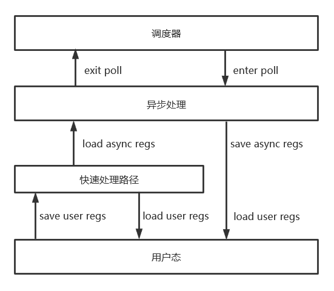

# 陷阱与上下文切换

## 用户态陷阱

FTL OS的用户态与内核态使用相同的页表，进入与离开用户态不需要清空TLB。但除了这一点外，共享页表为更多的优化方式提供了可能。在XV 6与rCore-tutorial中，由于使用了用户态独立的页表，用户态与内核态的切换方式通过跳板页（trampoline）实现，用户态的现场保存就在这里进行。trampoline通常映射在地址空间的最高位置，而在编译时通常放置在其他位置，因此从trampoline跳转至内核代码不能通过基于相对地址跳转的call进入内核，而必须从陷阱上下文中获取内核入口，通过寄存器跳转的方式进入内核。而当用户空间与内核空间共享页表时，陷阱入口可以直接设置为代码段中的陷阱入口函数，并直接通过call进入内核。

FTL OS采用了无栈协程，因此没有为每个进程分配内核栈，使用了不同的用户态切换方式。XV 6使用有栈上下文切换，因此一个CPU在从调度器进入用户态经过如下的两个过程：

1. 从调度态进入进程内核态，通过`_swtch`函数实现，函数将切换所有callee saved寄存器，进入进程内核上下文。
2. 从trap以函数调用的方式进入用户态，加载用户态的全部寄存器与部分特权寄存器，内核态的寄存器上下文直接丢弃。

从用户态进入调度器也经过两个过程：

1. 从trap进入内核，保存所有用户态寄存器，加载内核栈指针等必要上下文，进入内核处理函数，处理函数处于内核栈的栈底。
2. 通过`_swtch`函数切换所有callee saved寄存器，返回到调度器函数。

在这种处理方式下，进程内核态的处理就好像是用户在调用一个有状态的函数，尽管这个函数没有运行在用户栈上。

在基于无栈上下文切换的FTL OS中这一切都有所不同，从调度器进入用户态经过的两个过程如下：

1. 从调度态进入进程内核态，通过`Future`的`poll`函数实现。这部分实现由编译器完成的函数调用，没有寄存器的保存，在代码看来则是从`await`处开始执行。
2. 从`__enter_user`函数进入用户态。保存内核态的全部callee saved寄存器，加载用户态的全部寄存器与必要上下文。

从用户态进入调度器的过程如下：

1. 保存所有用户寄存器，加载内核态的callee saved寄存器与必要上下文，从`__enter_user`函数回到内核态。
2. 在`await`处退出正在执行的`poll`函数，回到调度器。

可以看到在无栈上下文切换中，进入用户态就好像是内核态在调用一个有状态的函数，尽管这个函数没有运行在内核栈上。

### 内核态处理快速路径

对于无栈上下文切换，进出用户态需要保存在有栈上下文切换时不需要保存的callee saved寄存器，就好像在过程1中一次性完成了有栈上下文切换的过程1与2，由于需要保存与恢复更多的寄存器，无栈上下文切换的用户态-内核态切换速度比有栈上下文切换慢。对这一速度劣势有一种优化方法，就是结合有栈上下文的切换方式，为每个线程分配一个“快速路径栈”。从异步上下文可以直接进入用户态；但从用户态进入陷阱时会先进入快速处理路径，如果快速处理路径可以完成处理将直接回到用户态，如果无法处理将回到异步上下文。这种方式下保存用户寄存器于保存异步上下文寄存器被拆分到了用户态与快速处理路径的跳转和快速处理路径与异步上下文的跳转，没有额外的寄存器开销。对于如`getpid`等系统调用，快速处理路径可以避免大量不必要的callee saved寄存器加载与保存。初赛阶段此优化尚未应用于FTL OS，将在未来应用于内核。



这种方案需要分配一个内核栈，由于快速处理路径不需要太复杂的逻辑，4 KB的内核栈已经足够了。

## 用户地址测试

发生系统调用时内核需要接收指向用户地址的指针，而此地址可能有效也可能无效，内核需要验证此指针指向的地址是否有效才能使用。由于用户地址处于低位地址，内核地址处于高位地址，因此首先需要测试指针是否指向内核高位地址。但指向低位地址并不意味着指针是安全的，因为这个指针可能处于未映射的内存，或者尝试向只读区域写入数据。用户发生页错误是安全的，但一旦在内核态发生页错误很可能直接导致内核崩溃。通常内核为了安全性不会直接用用户指针访问数据，而是在获取用户数据时从用户态复制到新的内存区域，写入数据时在特定函数完成写入，通常这是通过页表直接完成的。

为了提高性能，FTL OS采用了直接解引用用户指针的方式来传递用户态数据。为了安全地解引用用户态数据，FTL OS将在操作数据之前在指定函数对地址进行测试。在测试时内核不会查询页表，而是直接对指定页进行单字节的读与写并捕获内核产生的异常，这种方式在数据已经映射的情况下不会产生任何开销，但即便发生了异常，由于访存被限制在了特定区域，产生的异常类型是可以预测的，因此异常处理时不需要保存任何上下文，甚至可以将其看作一个特殊函数调用。

FTL OS的访存测试函数为如下：

```assembly
# kernel/src/user/check_impl.S
__try_read_user_u8:
    mv a1, a0
    mv a0, zero
    lb a1, 0(a1)
    ret
__try_write_user_u8:
    mv a2, a0
    mv a0, zero
    sb a1, 0(a2)
    ret
```

`__try_read_user_u8`与`__try_write_user_u8`只有一次字节访存，没有任何栈上操作，当页表正常映射时速度极快。

FTL OS的异常捕获函数为如下：

```assembly
# kernel/src/user/check_impl.S
try_access_user_error:
    csrr a0, sepc
    addi a0, a0, 4
    csrw sepc, a0
    li   a0, 1
    csrr a1, scause
    sret
```

如果异常没有发生，那么`a0`寄存器会被设置为0，否则将在异常中被设置为1。检查每次步长为4 KB，直接利用CPU的MMU硬件资源完成地址检查。需要注意的是这种检查方式替换了内核陷阱函数，而在遇到中断时会修改`a0`或`a1`寄存器导致内核不稳定甚至崩溃。一种解决此问题的方法是在检查用户地址时关中断，而这会增加中断响应时间。FTL OS使用了另一种方式，即使用向量陷阱模式。在向量陷阱模式下如果发生了异常，PC寄存器会被设置为`stvec.base`，而如果发生了中断，PC寄存器会被设置为`stvec.base + 4 × scause`。向量陷阱模式可以让异常和中断进入不同的处理函数，这样就可以保证异常处理函数只会在固定位置执行了。

## 用户态数据访问

用户地址空间通过测试后FTL OS将假定这部分映射永远有效，未来可能会增加锁定逻辑来避免空间在操作完成之前被提前释放。目前FTL OS处于用户数据操作状态时会忽略所有由用户地址错误引发的页错误并延迟到读取结束时处理。由于用户态的数据仅涉及数据而不涉及逻辑，忽略页错误只会降低操作系统速度并读出错误的数据，不会导致操作系统崩溃。

操作系统访问用户数据时处于内核态，要直接通过用户态数据指针访问数据需要将`sstatus`寄存器中的`sum`位设为1。FTL OS通过RAII管理此标志位，即访问用户数据需要持有`AutoSum`句柄来设置`sum`标志位，`AutoSum`析构时会释放`sum`标志位。但`sum`标志位的释放不是通过`AutoSum`自身管理的，而是将相关信息放置在了线程上下文并使用栈的方式管理，这样就能允许`AutoSum`被嵌套使用并在多个异步任务之间互不影响。

上述实现方式的`AutoSum`句柄能够跨越`await`，因此FTL OS绝大多数的系统调用都不会为用户数据分配内存，而是直接解引用用户态指针，这种方式能够将数据传输速度提高一倍。以通过管道将数据从写者传至读者为例，分配内存的方式中数据经过了用户态-临时内存-管道缓冲区-临时内存-用户态的变化，发生了4次复制与两次内存分配，而FTL OS中为用户态-管道缓冲区-用户态，只经过了两次复制，没有任何内存分配。